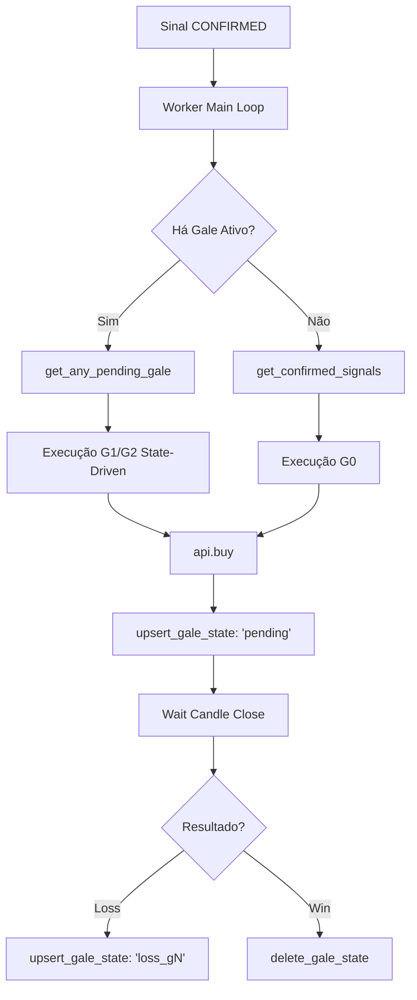

# PRD — IQ Option Executor Multi-Tenant (VPS)

**Versão:** 3.0.0 | **Atualizado:** 2026-03-05 | **Status:** Em Produção (Gale State-Driven)

---

## 1. Objetivo

Executar ordens na IQ Option para múltiplos clientes em paralelo, controlado 100% pelo Supabase HFT. A VPS opera como um motor de execução orientado a estado, garantindo resiliência total contra quedas de conexão e crashes.

**Premissas invioláveis:**

- **Zero Polling de Resultado:** Determinação de Win/Loss via Candle Close (Fechamento de Vela).
- **Gale Orientado a Estado:** Persistência no banco `iq_gale_state` para retomada instantânea.
- **Gale Instantâneo:** Disparo do próximo nível em < 200ms após perda detectada.
- **Isolamento de Processos:** 1 processo `multiprocessing` por cliente.

---

## 2. Arquitetura Geral (V3)

---

## 3. Servidores e Credenciais

| Recurso          | Valor                                            |
| ---------------- | ------------------------------------------------ |
| VPS IP           | `173.212.209.45`                                 |
| VPS User         | `root`                                           |
| VPS Path         | `/root/catalogadorderiv/VPS IQ OPTION/executor/` |
| Python VPS       | `/root/catalogadorderiv/.venv/bin/python`        |
| Supabase HFT URL | `https://ypqekkkrfklaqlzhkbwg.supabase.co`       |
| Log path         | `/root/catalogadorderiv/logs/executor.log`       |

---

## 4. Schema Supabase HFT (Core Gale)

### `iq_gale_state` — Hub de Inteligência (Novo)

Esta tabela é a **única fonte de verdade** para o Gale. Se o worker crashar, ele lê esta tabela ao voltar e sabe exatamente onde parou.

| Campo         | Tipo        | Descrição                           |
| ------------- | ----------- | ----------------------------------- |
| `client_id`   | TEXT        | ID do Bot                           |
| `signal_id`   | TEXT        | ID do Sinal original                |
| `last_result` | TEXT        | `pending` \| `loss_g0` \| `loss_g1` |
| `created_at`  | TIMESTAMPTZ | Timestamp de criação                |

**Lógica de Codificação:**

- `loss_g0`: Indica que o G0 perdeu. Próxima tentativa: G1.
- `loss_g1`: Indica que o G1 perdeu. Próxima tentativa: G2.
- `pending`: Ordem enviada à corretora, aguardando fechamento da vela.

---

## 5. Implementação Técnica

### Determinação via Candle Close

O robô não espera o payout da corretora (que pode levar 5s+).

1. **Entry**: Captura o preço de entrada logo após o `api.buy()`.
2. **Timing**: Calcula os milissegundos restantes até o fechamento da vela de 1 min.
3. **Check**: No segundo 59, solicita o `close` via `api.get_candles()`.
4. **Compare**:
   - `CALL`: `close > entry` = WIN
   - `PUT`: `close < entry` = WIN

### Gale Instantâneo

Assim que o `LOSS` é detectado pelo candle close, o worker:

1. Grava `loss_gN` no Supabase.
2. Dá `continue` no loop principal.
3. O próximo ciclo do loop detecta o estado de perda e dispara a próxima ordem em milissegundos.

### Multiplicadores (PRD)

- **G0**: 1.0x
- **G1**: 2.2x
- **G2**: 5.0x

---

## 6. Fluxo de Resiliência

| Evento                | Ação do Sistema                                                                                                                                                     |
| --------------------- | ------------------------------------------------------------------------------------------------------------------------------------------------------------------- |
| Crash do Worker no G1 | Ao reiniciar, o Supervisor lança o Worker. O Worker lê `loss_g0` em `iq_gale_state` e dispara o G1 imediatamente, mesmo que o sinal original tenha sido há minutos. |
| Lentidão na Corretora | O sistema ignora o delay de payout da IQ. O Gale entra no tempo certo da vela, independentemente do saldo ser atualizado.                                           |
| Conflito de Status    | O status `pending` no banco bloqueia duplicatas. Um sinal só é re-executado se falhar explicitamente ou se o tempo de timeout (3 min) expirar.                      |

---

## 7. Próximos Passos (Roadmap)

- [x] Gale (G1/G2) State-Driven
- [x] Lógica de Candle Close (Gale Instantâneo)
- [ ] SSH por chave (remover senha)
- [ ] Dashboard consumindo `vw_iq_session_stats`
- [ ] Integração com Notificações Telegram/Discord para Gale Status
